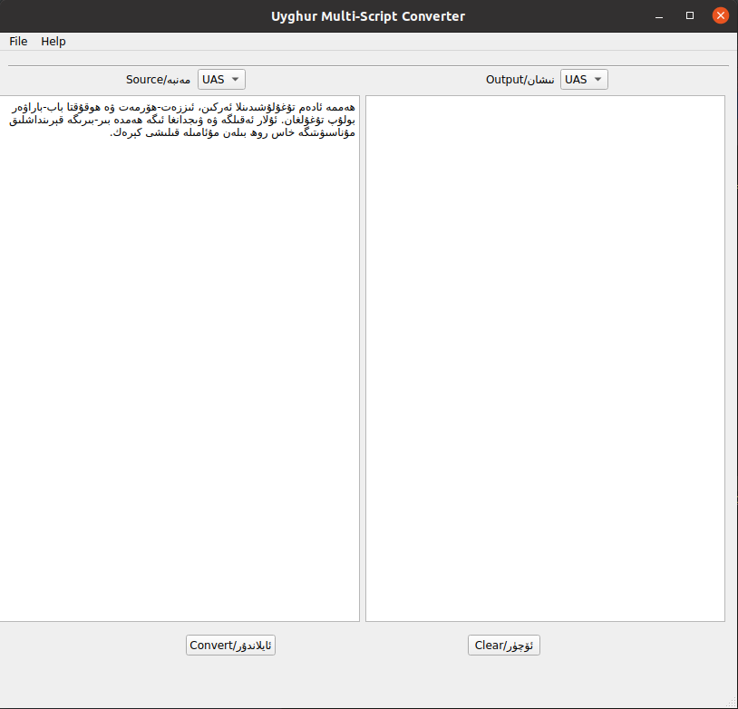

# Multiple-Uyghur-Script-Converter
This converter converts multiple Uyghur scripts such as **ULS**(Uyghur Latin Script), **UAS**(Uyghur Arabic Script), 
**CTS**(Common Turkish Script), **UCS**(Uyghur Cyrillic Script) and **UYS** (Uyghur Yengi (new) Script).

| UAS | CTS | ULS| UCS|UYS|
|----|----| ---- | --- | -- |
| ا  | a  | a    | а   |a |
| ە  | e  | e    | ә   |ə |
| ب  | b  | b    | б   |b |
| پ  | p  | p    | п   |p |  
| ت  | t  | t    | т   |t |
| ج  | c  | j    | җ   |j |
| چ  | ç  | ch   | ч   |q |
| خ  | x  | x    | х   |h |
| د  | d  | d    | д   |d |
| ر  | r  | r    | р   |r |
| ز  | z  | z    | з   |z |
| ژ  | j  | zh   | ж   |ⱬ |
| س  | s  | s    | с   |s |
| ش  | ş  | sh   | ш   |x |
| ف  | f  | f    | ф   |f |
| ڭ  | ñ  | ng   | ң   |ng |
| ل  | l  | l    | л   |l |
| م  | m  | m    | м   |m |
| ھ  | h  | h    | һ   |ⱨ |
| و  | o  | o    | о   |o |
| ۇ  | u  | u    | у   |u |
| ۆ  | ö  | ö    | ө   |ɵ |
| ۈ  | ü  | ü    | ү   |ü |
| ۋ  | v  | w    | в   |w |
| ې  | é  | é    | е   |e |
| ى  | i  | i    | и   |i |
| ي  | y  | y    | й   |y |
| ق  | q  | q    | қ   |ⱪ |
| ك  | k  | k    | к   |k |
| گ  | g  | g    | г   |g |
| ن  | n  | n    | н   |n |
| غ  | ğ  | gh   | ғ   |ƣ |
| ئ  |    |      |     | |
| يا | ya | ya   | я   |ya |
| يۇ | yu | yu   | ю   |yu |

# Functions
	UAS to ULS (uyghur arab yeziqidin uyghur latin yeziqigha)
	UAS to UCT (uyghur arab yeziqidin ortaq turk yeziqigha)

# Sample input and output examples

|UAS|CTS|ULS|UCS| UYS                                                                                                                                                                                                                                                                                                                                                                         |
|-------- | ------ | ---- | -----|-----------------------------------------------------------------------------------------------------------------------------------------------------------------------------------------------------------------------------------------------------------------------------------------------------------------------------------------------------------------------------|
قول باش پۇت كۆز جەڭچى جۇدې سان سەي ئې شىر شاڭخەي كىتاب ۋەتەن تومۇر  كۆمۈر ئېلىكتىر ۋەتەن ۋيېتنام شىنجاڭ ئانار ئەنجۈر ئوردا ئۇرۇش  ئۆردەك ئۈزۈم ئېلان ئىنكاس ئىنىكئانا ئەسئەت رادىئو مەسئۇل قارىئۆرۈك نائۈمىد  ئىتئېيىق جەمئىي نەمەنگان ئۆزخان پاسخا بايرىمى مائارىپ مۇئەللىم دائىرە مۇئەييەن تەبىئىي پائالىيەت ئىسھاق ئۆزبېكىستانغا ھىنگان چەكلەنگەن گاڭگىراپ باشلانغۇچ جەمئىيەت جۇڭخۇا| qol baş put köz ceñçi cudé san sey é şir şañxey kitab veten tomur  kömür éliktir veten vyétnam şincañ anar encür orda uruş  ördek üzüm élan inkas inik'ana es'et radio mes'ul qariörük naümid  it'éyiq cem'iy nemengan özxan pasxa bayrimi maarip muellim daire mueyyen tebiiy paaliyet ishaq özbékistanğa hingan çeklengen gañgirap başlanğuç cem'iyet cuñxua|qol bash put köz jengchi judé san sey é shir shangxey kitab weten tomur kömür éliktir weten wyétnam shinjang anar enjür orda urush ördek üzüm élan inkas inik'ana es'et radi'o mes'ul qari'örük na'ümid it'éyiq jem'iy nemen'gan özxan pasxa bayrimi ma'arip mu'ellim da'ire mu'eyyen tebi'iy pa'aliyet is'haq özbékistan'gha hin'gan cheklen'gen ganggirap bashlan'ghuch jem'iyet jungxua |қол баш пут көз җәңчи җуде сан сәй е шир шаңхәй китаб вәтән томур көмүр еликтир вәтән вйетнам шинҗаң анар әнҗүр орда уруш өрдәк үзүм елан инкас иник'ана әс'әт ради'о мәс'ул қари'өрүк на'үмид ит'ейиқ җәм'ий нәмәнган өзхан пасха байрими ма'арип му'әллим да'ирә му'әййән тәби'ий па'алийәт исһақ өзбекистанға һинган чәкләнгән гаңгирап башланғуч җәм'ийәт җуңхуа|ⱪol bax put køz jəngqi jude san səy e xir xanghəy kitab wətən tomur kømür eliktir wətən wyetnam xinjang anar ənjür orda urux ørdək üzüm elan inkas inik'ana əs'ət radi'o məs'ul ⱪari'ørük na'ümid it'eyiⱪ jəm'iy nəmən'gan øzhan pasha bayrimi ma'arip mu'əllim da'irə mu'əyyən təbi'iy pa'aliyət isⱨaⱪ øzbekistanƣa ⱨin'gan qəklən'gən ganggirap baxlanƣuq jəm'iyət junghua |

# User interface

This converter has a simple user interface. Pyqt5 is used for UI.

# insert an image with markdown


Run UI
``` 
python umsc.py
```

Run from terminal
```
 python converter.py -s uas -t uys -i <input file> -o <output file>
```

If you are goint to edit UI, convert the ui file to python file.
```        
pyuic5 -x mainWindow.ui -o mainWindow.py
```

# Files
name | info
-----|----
mainWindow.ui | pyqt user interface
converter.py | functions for converting
umsc.py | main function for running the program which includes mainWindow.py and converter.py
materials | official materials for uyghur script converter
php_code  | this python code is improved version of the php code which is written by Mr. Gheyret Kenji.

# TODO

- [ ] check the code for bugs
- [ ] check UI
- [ ] Add explanations for the method